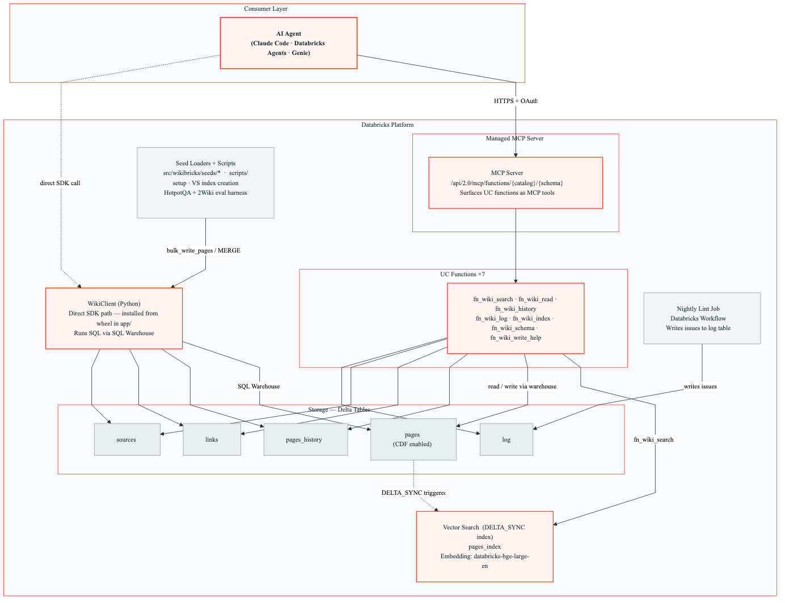

# WikiBricks

A **domain-agnostic memory pattern for AI agents on Databricks.** Delta-backed wiki
with Vector Search, versioned writes, typed links, and a Unity-Catalog-function
MCP surface. No bespoke serving layer, no extra infrastructure - deploy the bundle
and agents can read and write structured knowledge in under 20 minutes.

## What it is

WikiBricks gives agents a persistent, queryable, versioned knowledge store:

- **Delta + Vector Search** - five Delta tables (`pages`, `pages_history`, `links`,
  `sources`, `log`) plus a DELTA_SYNC Vector Search index over `pages` for semantic
  retrieval. All infrastructure lives in Unity Catalog.
- **Managed MCP via UC functions** - seven Unity Catalog functions
  (`fn_wiki_search`, `fn_wiki_read`, `fn_wiki_history`, `fn_wiki_log`,
  `fn_wiki_index`, `fn_wiki_schema`, `fn_wiki_write_help`) are automatically exposed
  as MCP tools at `/api/2.0/mcp/functions/<catalog>/<schema>`. No FastMCP, no extra
  server code.
- **Versioned writes** - every write archives the previous version; `fn_wiki_history`
  returns the full lineage. `pages` has CDF enabled for downstream consumers.
- **Typed links** - cross-references between pages carry a `link_type`
  (`cites`, `related`, `supports`, `depends_on`, …). Graph traversal is plain SQL.
- **Three search modes** - HYBRID (default), ANN, FULL_TEXT - one kwarg switch per
  query against the same index.
- **Auto-promote** - the reference Streamlit chat judges every answer on a 1-5 scale;
  score ≥ 4 writes a synthesis page to `promoted/<slug>` with `cites` links to source
  pages.
- **Nightly lint** - a Databricks Workflow scans for orphan pages, stale content,
  duplicates, and broken links, writing issues to the `log` table.

## Architecture



Top to bottom: an AI agent (Claude Code, a Databricks agent, Genie, anything with
an MCP client) calls the Databricks managed MCP server over HTTPS + OAuth. The MCP
server surfaces seven UC functions. `fn_wiki_search` queries the Vector Search
index (DELTA_SYNC-triggered from `pages`); the others read and write the Delta
tables via the SQL warehouse. The packaged `WikiClient` offers a direct SDK path
for notebooks and scripts - useful for bulk ingest and the evaluation harness.

## Quick start

Prerequisites: a Databricks workspace with Unity Catalog, a SQL warehouse, and a
Vector Search endpoint.

```bash
git clone https://github.com/philtief/wikibricks.git
cd wikibricks
databricks bundle deploy --target dev
databricks bundle run deploy_wiki_store --target dev
```

Override defaults per target:

```bash
databricks bundle deploy --target dev \
  --var="catalog=my_catalog" \
  --var="schema=wiki" \
  --var="warehouse_id=abc123" \
  --var="vs_endpoint=my-vs-endpoint" \
  --var="seed_domain=sample"
```

After the deploy notebook finishes, the MCP endpoint is live at:

```
https://<workspace>/api/2.0/mcp/functions/<catalog>/<schema>
```

Point any MCP client at it.

## Seed domains

| Domain | Contents |
|--------|----------|
| `sample` (default) | Five meta-pages describing WikiBricks itself - for smoke tests and the baseline AutoEval |
| `hotpot` | HotpotQA benchmark corpus (~66k pages, ~15k typed links). See [`examples/hotpotqa.md`](examples/hotpotqa.md) |
| `custom` | Empty - point `WIKIBRICKS_CUSTOM_PAGES` at your own JSONL |
| `none` | No seed |

The 2WikiMultiHopQA corpus is ingested by the evaluation harness
([`scripts/twowiki_*.py`](scripts/), [`examples/twowiki.md`](examples/twowiki.md))
rather than the built-in seed loader; it deploys into its own schema (`wiki_2wiki`).

## Core API

The `WikiClient` wraps the SQL warehouse for direct-SDK use:

```python
from wikibricks import WikiClient

wiki = WikiClient(warehouse_id="abc123")

wiki.write_page(
    path="topics/vector-search",
    title="Vector Search",
    content={"summary": "...", "body": "..."},
    tags=["retrieval"],
)

page = wiki.read_page("topics/vector-search")
results = wiki.search("what index modes exist", mode="HYBRID", num_results=5)
versions = wiki.history("topics/vector-search")

wiki.bulk_write_pages(rows_iter)          # MERGE-based, resumable
wiki.promote_answer(query, answer, cites) # synthesis page + cites edges
wiki.materialize_index()                  # refresh `_meta/index`
```

See [`src/wikibricks/client.py`](src/wikibricks/client.py) for the full surface.

## MCP tools

Each UC function is an MCP tool; agents discover them automatically on connect.

| Tool | Description |
|------|-------------|
| `fn_wiki_search(question, mode)` | Search pages by keyword, semantic, or hybrid match |
| `fn_wiki_read(page_path)` | Read a wiki page by path |
| `fn_wiki_history(page_path)` | Get version history for a page |
| `fn_wiki_log(num_entries)` | Get recent operation log entries |
| `fn_wiki_index()` | Get the full wiki page catalog |
| `fn_wiki_schema()` | Get wiki conventions (page types, paths, tags, link types) |
| `fn_wiki_write_help()` | Get documentation on how to write wiki pages |

Authentication is OAuth with the `unity-catalog` scope; UC permissions are
enforced.

## Evaluation

We ran two external evaluations against WikiBricks. Both are **honest**: WikiBricks
is infrastructure, not a multi-hop QA system, and the numbers reflect that.

- **HotpotQA (retrieval-only)**: 500-query pilot on a 66,569-page corpus. HYBRID
  recall@10 ≈ 89% against the published dev set. Not a HotpotQA leaderboard
  submission - retrieval-only recall@k is not a recognized HotpotQA metric. See
  [`docs/hotpotqa_evaluation.md`](docs/hotpotqa_evaluation.md).
- **2WikiMultiHopQA (open-retrieval, official v1.1 eval)**: 350-query preliminary
  ablation. Best variant (Sonnet 4.6 + HYBRID + K=10) lands at **Joint F1 21.2** -
  within noise of the 2020 paper's own open-retrieval baseline (~20). Modern
  2024-2025 open-retrieval SOTA is 50-65 (task-tuned retrievers, iterative
  multi-hop, cross-encoder rerankers, fine-tuned heads - none in WikiBricks' scope).
  Full 8-variant ablation and positioning in
  [`docs/twowiki_evaluation.md`](docs/twowiki_evaluation.md).

Numerical output is produced by `scripts/hotpot_*.py` and `scripts/twowiki_*.py`;
everything is reproducible end-to-end.

## Development

```bash
uv sync
uv run pytest -q                     # 220 tests
uv run ruff check src/ app/ tests/
```

Build the wheel:

```bash
uv build
# → dist/wikibricks-0.1.0-py3-none-any.whl
```

Repository layout:

- `src/wikibricks/` - published package (`WikiClient`, `ops`, seed loaders)
- `app/` - reference Streamlit chat (auto-promote live)
- `notebooks/` - deploy, run-autoeval, maintenance, benchmark
- `resources/` - Databricks Asset Bundle resources (jobs, apps, dashboard)
- `scripts/` - evaluation harness (HotpotQA + 2WikiMultiHopQA)
- `tests/` - 220 unit tests, no Databricks connectivity required
- `databricks.yml` - bundle entrypoint

## What WikiBricks is not

- **Not a multi-hop QA system.** We rely on Claude (or any LLM) at inference time.
  Our evaluation numbers sit at the 2020 open-retrieval baseline; we do not
  compete with task-tuned retrievers or fine-tuned answer heads.
- **Not a vector database product.** The index is Databricks Vector Search. If
  you need a standalone vector DB, use one.
- **Not a managed SaaS.** WikiBricks ships as a Databricks Asset Bundle that
  deploys into your own workspace. You own the data and the runtime.
- **Not a replacement for agent-specific state.** It is a shared, versioned
  knowledge store - not short-term scratch memory or per-session conversation
  state.

## License

Apache 2.0 - see [`LICENSE`](LICENSE).
